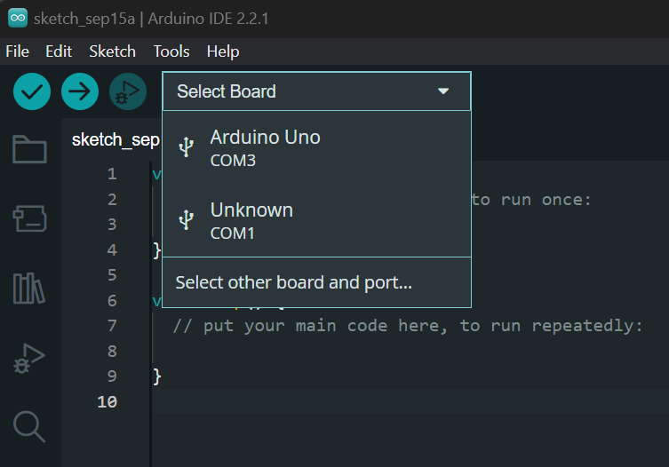
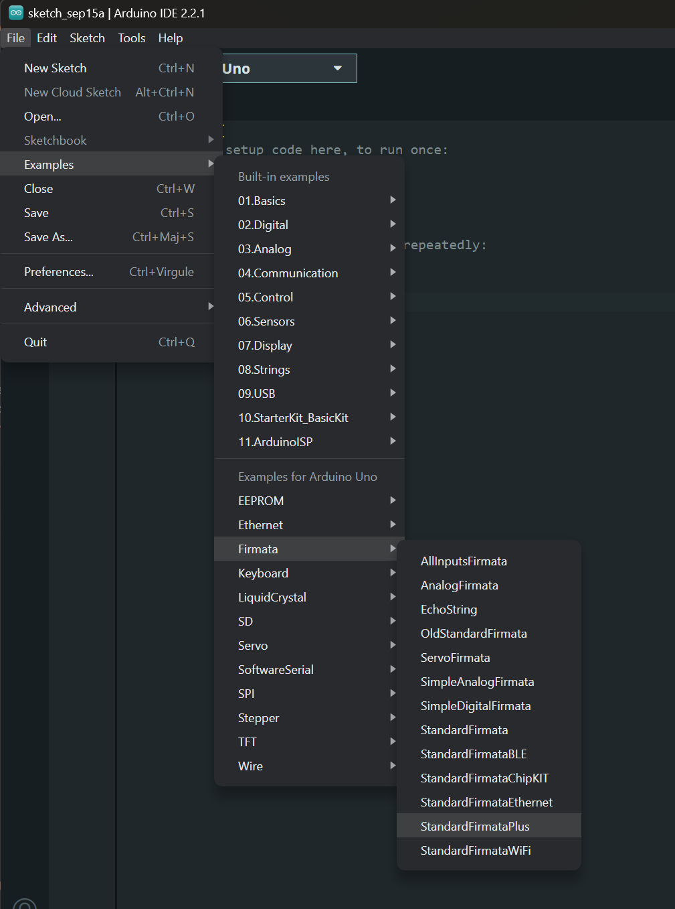
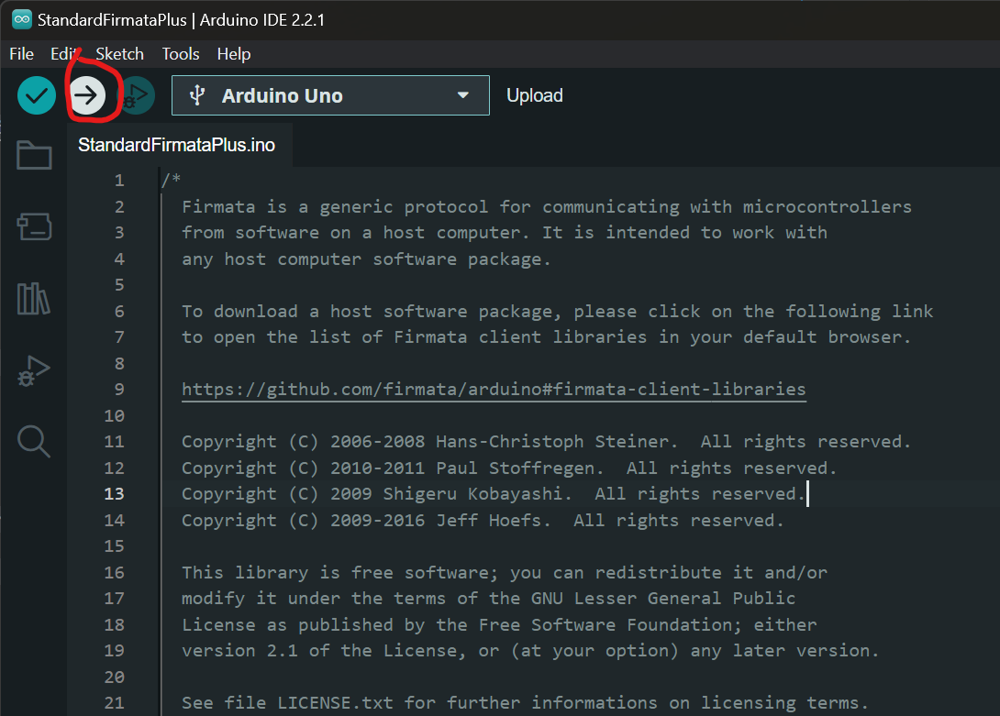

# README du Projet : Combinaison d'espaces de travail Arduino et Vite avec WebSockets

Ce projet vise à programmer un robot "Chopper" en combinant la puissance d'un projet Arduino utilisant la bibliothèque Johnny-Five avec un serveur Web (Vite), établissant une communication transparente entre les deux en utilisant les WebSockets. Ce README vous guidera à travers la configuration et le lancement du projet.

## Table des matières
- [README du Projet : Combinaison d'espaces de travail Arduino et Vite avec WebSockets](#readme-du-projet--combinaison-despaces-de-travail-arduino-et-vite-avec-websockets)
  - [Table des matières](#table-des-matières)
  - [Prérequis](#prérequis)
  - [Installation](#installation)
    - [Sur ordinateur :](#sur-ordinateur-)
    - [Sur l'Arduino : (à mettre à jour)](#sur-larduino--à-mettre-à-jour)
  - [Configuration](#configuration)
  - [Utilisation](#utilisation)
  - [Structure du Projet (TODO)](#structure-du-projet-todo)
  - [Contributions](#contributions)
  - [Licence](#licence)

## Prérequis

Avant de commencer, assurez-vous d'avoir les éléments suivants installés sur votre système :

- **IMPORTANT: Si Windows et AVANT installation de Node** Dans un Powershell en mode Administrateur: **Set-ExecutionPolicy AllSigned** (source https://www.geekbits.io/how-to-install-chocolatey-on-windows-11/#check-powershell-execution-policy)
- [Node.js](https://nodejs.org/) (version recommandée)
  - **IMPORTANT: dans l'installer de Node** Bien cocher la même case **"Automatically install necessary tools"**
  Cela va installer **Python** et **node-gyp** qui sont obligatoires au bon fonctionnement de JohnnyFive (https://github.com/rwaldron/johnny-five/wiki/Getting-Started#prerequisites)
- [npm](https://www.npmjs.com/) (est généralement inclus dans l'installation de Node.js)
- Installer l'[IDE d'Arduino](https://www.arduino.cc/en/software) pour qu'il install les drivers nécessaires
- Brancher une carte Arduino compatible avec la bibliothèque [Johnny-Five](http://johnny-five.io/)

## Installation

### Sur ordinateur :
1. Dans l'IDE Arduino
   - Sélectionnez la bonne board
   
   - Afficher le Sketch StandardFirmataPlus.ino
   
   - Uploadez le sur la board Arduino, comme n'importe quel programme Arduino
   
   - Quittez l'IDE

2. Dans un terminal
   - Clonez le dépôt :

   ```bash
   git clone https://github.com/lbineau/arduino-websocket
   ```

   - Accédez au répertoire du projet :

   ```bash
   cd arduino-websocket
   ```

   - Installez les dépendances pour les deux espaces de travail :

   ```bash
   npm install
   ```

### Sur l'Arduino : (à mettre à jour)
  - Connecter la commande de direction sur le pin 3
  - Connecter la commande de puissance sur le pin 12


## Configuration

- Adapter le port de la board Arduino si necessaire dans `robot/index.js` (vous le trouvez dans l'IDE d'Arduino)
```js
const board = new Board({ port: "COM3" })
```

## Utilisation

1. **Lancement du Projet :**

   - Lancez le serveur Vite ainsi que le script Johnny-Five grâce à la commande unique

     ```
     npm run start
     ```

   - Ouvrez votre navigateur web et accédez à l'URL affichée dans le terminal.


2. **Interagir via la page HTML**
   - Ouvrez votre navigateur web et accédez à l'URL affichée dans le terminal. 
   *http://localhost:1234*

   - Interagissez avec l'application web et observez les logs de communication entre le serveur Node et la carte Arduino via les WebSockets.
   - Si l'Arduino a bien été configuré il devrait également réagir

## Structure du Projet (TODO)

```
your-project/
├── arduino-workspace/
│   ├── arduino-script.js
│   ├── package.json
│   └── ...
├── vite-workspace/
│   ├── src/
│   │   ├── index.html
│   │   ├── main.js
│   │   └── ...
│   ├── package.json
│   └── ...
└── README.md
```

## Contributions

Les contributions sont les bienvenues ! Si vous trouvez des problèmes ou avez des suggestions d'améliorations, n'hésitez pas à ouvrir une issue ou à créer une pull request.

## Licence

Ce projet est sous licence [MIT](LICENSE).

---